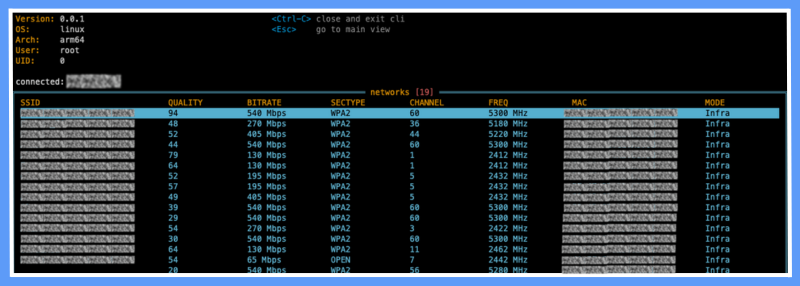
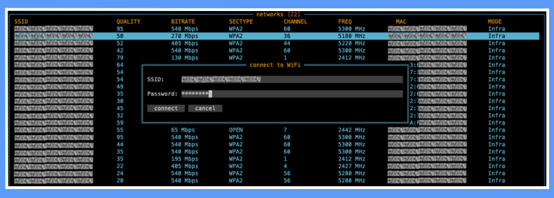

<picture>
    <source media="(prefers-color-scheme: dark)" srcset="https://github.com/Mad-Pixels/.github/raw/main/profile/banner.png">
    <source media="(prefers-color-scheme: light)" srcset="https://github.com/Mad-Pixels/.github/raw/main/profile/banner.png">
    
</picture>

# WF — Terminal-based Wi-Fi Manager for Linux/Raspberry Pi
[](LICENSE)
[](https://golang.org)

**`wf`** is a terminal-based Wi-Fi manager designed for minimal environments like Raspberry Pi, headless Linux servers, and embedded systems.  
It provides a modern TUI (Text-based User Interface) to **scan**, **connect**, and **view wireless network details** — all powered by **NetworkManager** over **D-Bus**.

## 💡 Why?
Because nmcli sucks for humans, nmtui is dated, and there's no intuitive, keyboard-friendly CLI tool for managing Wi-Fi on a Raspberry Pi.
wf aims to change that.

## ✨ Features
- 🔍 Scan available Wi-Fi networks
- 🔐 Connect to WPA/WPA2/WEP or open networks
- 📡 View current network connection status
- 🖥️ Built with [tview](https://github.com/rivo/tview) — clean and responsive UI
- 💻 Works on Raspberry Pi (or any Linux with NetworkManager)
- 🔌 No X / desktop environment required

## 📸 Preview
<div align="center">

  **Scan:**  
  

  **Connect:**  
  

</div>

## 🚀 Getting Started
### Requirements

- Linux OS with `NetworkManager`
- D-Bus access (`dbus-daemon` must be running)
- Go 1.22+ (for building)

### Run (from source)
```bash
git clone https://github.com/yourname/wf.git
cd wf
go run cmd/main.go
```

# Contributing
We're open to any new ideas and contributions. We also have some rules and taboos here, so please read this page and our [Code of Conduct](/CODE_OF_CONDUCT.md) carefully.

## I want to report an issue
If you've found an issue and want to report it, please check our [Issues](https://github.com/Mad-Pixels/wf/issues) page.
